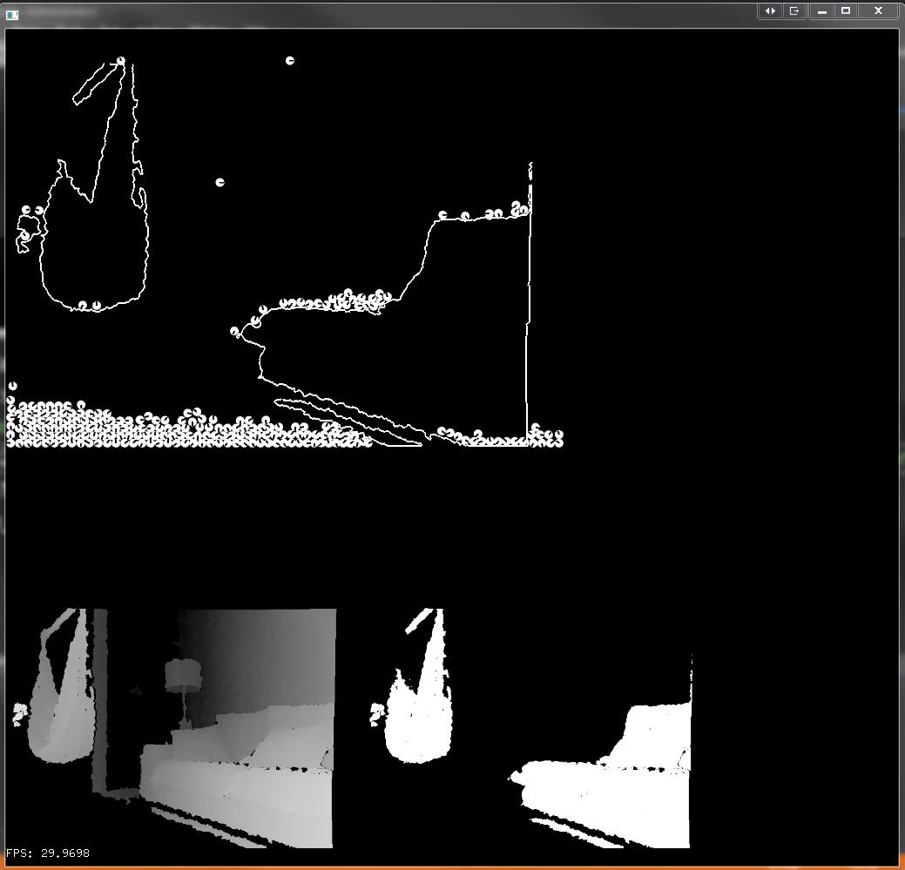

### kinect with Box @D and openCV
 * using kinect depth sensors to capture RGB & depth data
 * cropping then passing threshholded depth image to openCV for coutour finding
 * using the contours extracted by openCV to pass to box2D physics engine
 * detecting collisions with Box2D with particles and our extracted kinect countour line

#### controls
* c clear all circles
* f toggle fullscreen
* d draw our lines that circles will fail off
* w Invert depth
* up / down keys tilt kinect up down
* + / -  increase and decrease near threshold on kinect capture
* < / > increase and decrease far threshold on kinect capture

